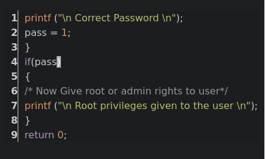
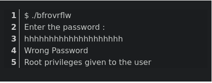

Buffer Overflow
===============

### 👉 What is Buffer Overflow ?

A buffer overflow occurs when a program or process attempts to write more data to a fixed-length block of memory, or buffer, than the buffer is allocated to hold. 

Buffers contain a defined amount of data; any extra data will overwrite data values in memory addresses adjacent to the destination buffer.

That sort of overflow can be avoided if the program includes sufficient bounds checking to flag or discard data when too much is sent to a memory buffer.

  

* * *

### 👉 What is Buffer Overflow Attack

Attackers exploit buffer overflow issues by overwriting the memory of an application. 

This changes the execution path of the program, triggering a response that damages files or exposes private information. 

For example, an attacker may introduce extra code, sending new instructions to the application to gain access to IT systems. 

If attackers know the memory layout of a program, they can intentionally feed input that the buffer cannot store, and overwrite areas that hold executable code, replacing it with their own code. 

For example, an attacker can overwrite a pointer (an object that points to another area in memory) and point it to an exploit payload, to gain control over the program.

  

* * *

### 👉 Buffer Overflow Attack Example

  
   

* * *

### 👉Types of Buffer Overflow Attacks

🌟 Stack-based buffer overflows are more common, and leverage stack memory that only exists during the execution time of a function.

  

🌟 Heap-based attacks are harder to carry out and involve flooding the memory space allocated for a program beyond memory used for current runtime operations.

  

* * *

### 👉 What Programming Languages are More Vulnerable?

C and C++ are two languages that are highly susceptible to buffer overflow attacks, as they don’t have built-in safeguards against overwriting or accessing data in their memory. 

Mac OSX, Windows, and Linux all use code written in C and C++.

  

Languages such as PERL, Java, JavaScript, and C# use built-in safety mechanisms that minimize the likelihood of buffer overflow.

  

* * *

README.modern

### 👉 How to Prevent Buffer Overflows ?

Developers can protect against buffer overflow vulnerabilities via security measures in their code, or by using languages that offer built-in protection.

In addition, modern operating systems have runtime protection. 

Three common protections are :

🌟 Address space randomization (ASLR)—randomly moves around the address space locations of data regions.

Typically, buffer overflow attacks need to know the locality of executable code, and randomizing address spaces makes this virtually impossible

  

🌟 Data execution prevention—flags certain areas of memory as non-executable or executable, which stops an attack from running code in a non-executable region.

  

🌟Structured exception handler overwrite protection (SEHOP)—helps stop malicious code from attacking Structured Exception Handling (SEH), a built-in system for managing hardware and software exceptions. 

It thus prevents an attacker from being able to make use of the SEH overwrite exploitation technique. 

At a functional level, an SEH overwrite is achieved using a stack-based buffer overflow to overwrite an exception registration record, stored on a thread’s stack.

  

* * *

### 👉 Key Concepts of Buffer Overflow

This error occurs when there is more data in a buffer than it can handle, causing data to overflow into adjacent storage.

  

This vulnerability can cause a system crash or, worse, create an entry point for a cyberattack.

  

Secure development practices should include regular testing to detect and fix buffer overflows. 

These practices include automatic protection at the language level and bounds-checking at run-time.

  

* * *

### 👉 Buffer Overflow Solutions

To prevent buffer overflow, developers of C/C++ applications should avoid standard library functions that are not bounds-checked, such as gets, scanf and strcpy.

  

In addition, secure development practices should include regular testing to detect and fix buffer overflows. 

The most reliable way to avoid or prevent buffer overflows is to use automatic protection at the language level. 

Another fix is bounds-checking enforced at run-time, which prevents buffer overrun by automatically checking that data written to a buffer is within acceptable boundaries.
